# ClearLedger

**Payment reconciliation engine and dashboard.** Matches internal payment records against provider settlement data (Stripe, PayPal, bank transfers) using confidence scoring, classifies every record that does not reconcile, and lets you query the results in plain English.

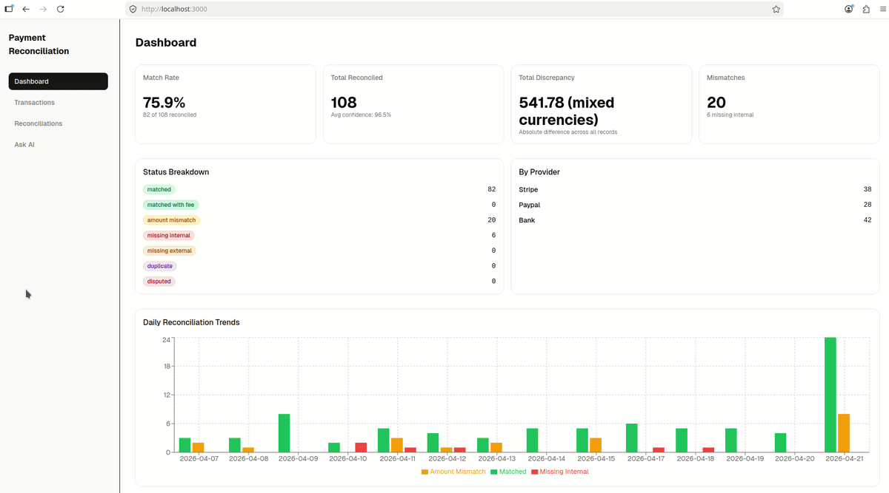
*Seed data, dashboard, reconciliation list, scoring detail, trends chart, natural language query.*

---

## The problem

Every payment exists in two places: the internal ledger and the provider's records. They rarely line up cleanly. Providers deduct fees, settlement lands days later, and provider records almost never carry a clean foreign key back to the internal payment ID. Exact-key joins miss most of these cases, so reconciliation teams end up matching by hand.

ClearLedger scores each provider record against candidate internal payments on amount, payment instrument, merchant and date, converts that score into a confidence percentage, and assigns one of seven statuses. Anything that does not reconcile is surfaced instead of silently dropped.

## Highlights

- **Confidence scoring engine** with a dynamic maximum score, so a PayPal wallet payment and a Stripe card payment are each judged only on the fields they actually carry.
- **Fee-aware matching** that recognizes when the provider amount equals the internal amount minus fees.
- **Seven reconciliation statuses**, including `missing_internal` and `missing_external` for one-sided records.
- **Async FastAPI backend** (SQLAlchemy async, asyncpg) with all money stored as integer minor units.
- **React 19 dashboard** with KPIs, filterable grids, per-match scoring breakdowns and daily trends.
- **Natural language queries** through a LangChain + Claude NL-to-SQL chain.
- **n8n workflows** that simulate continuous provider feeds on cron schedules.
- **61 automated tests** across the API and the frontend.

## Architecture

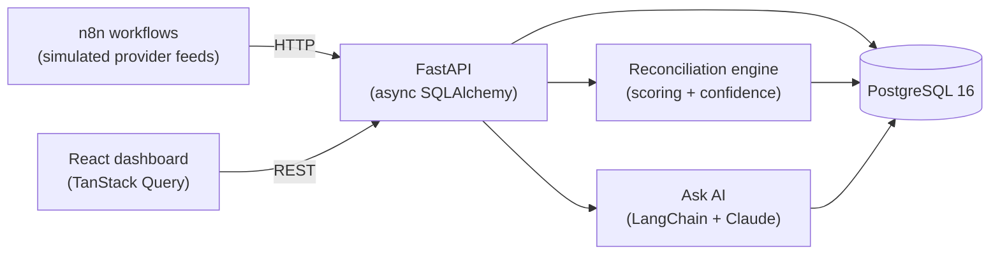

## Tech stack

| Layer | Technology |
|-------|-----------|
| Backend | Python 3.12, FastAPI, SQLAlchemy (async), Pydantic v2, asyncpg |
| Database | PostgreSQL 16 |
| Data processing | Pandas (trend aggregation) |
| NL queries | LangChain, Anthropic Claude (claude-sonnet-4) |
| Frontend | React 19, TypeScript 5, Vite 8, shadcn/ui, Tailwind CSS v4 |
| Data layer (web) | TanStack Query v5, TanStack Table v8, Recharts |
| Workflow automation | n8n |
| Infrastructure | Docker Compose |
| Testing and linting | pytest, pytest-asyncio, httpx, Vitest, Testing Library, ruff, ESLint |

---

## Quick start

Requirements: Docker, and an Anthropic API key if you want the Ask AI feature.

```bash
git clone https://github.com/tusharpanthri/clear-ledger.git
cd clear-ledger
cp apps/api/.env.example apps/api/.env   # set ANTHROPIC_API_KEY for Ask AI
docker compose up -d
npm run initial-seed
```

Then open **http://localhost:3000**.

| Service | URL |
|---------|-----|
| Web dashboard | http://localhost:3000 |
| API and Swagger UI | http://localhost:8000/docs |
| n8n | http://localhost:5678 |
| PostgreSQL | localhost:5432 |

`npm run initial-seed` runs `scripts/initial-seed.sh`, which checks API health, seeds 3 currencies (USD, EUR, GBP), 3 providers (Stripe, PayPal, Bankinter) and 3 merchants, generates 15 internal payments, simulates the matching Stripe, PayPal and bank records, adds 2 orphan records per provider, and runs the reconciliation engine. It requires `curl`.

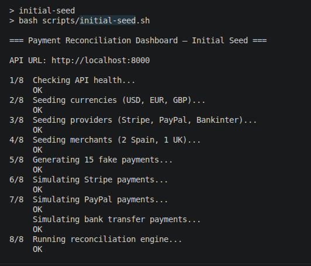
*Output of `npm run initial-seed`: 8 sequential API calls with progress.*

<details>
<summary><b>Local development (API and web outside Docker)</b></summary>

Prerequisites: Python 3.12+, Node.js 20+.

```bash
# 1. Start PostgreSQL and n8n
docker compose up -d postgres n8n

# 2. Backend
cd apps/api
python -m venv .venv
source .venv/bin/activate        # Windows: .venv\Scripts\activate
pip install -r requirements.txt
cp .env.example .env             # set DATABASE_URL and ANTHROPIC_API_KEY
fastapi dev app/main.py          # http://localhost:8000

# 3. Frontend (new terminal)
cd apps/web
npm install
npm run dev                      # http://localhost:5173
```

In this mode the dashboard is served by Vite at **http://localhost:5173**, not port 3000. Seed data the same way with `npm run initial-seed` from the repo root.

</details>

<details>
<summary><b>Other ways to seed data (curl, Swagger UI, n8n)</b></summary>

**Manual curl**

```bash
# Reference data
curl -X POST http://localhost:8000/seed/currencies
curl -X POST http://localhost:8000/seed/providers
curl -X POST http://localhost:8000/seed/merchants

# Internal payments (count 1 to 50, default 5)
curl -X POST "http://localhost:8000/payments/generate?count=15"

# Provider records
curl -X POST http://localhost:8000/stripe-payments/simulate
curl -X POST http://localhost:8000/paypal-payments/simulate
curl -X POST http://localhost:8000/bank-payments/simulate

# Optional: orphan provider records (produce missing_internal)
curl -X POST "http://localhost:8000/stripe-payments/simulate-orphan?count=2"
curl -X POST "http://localhost:8000/paypal-payments/simulate-orphan?count=2"
curl -X POST "http://localhost:8000/bank-payments/simulate-orphan?count=2"

# Reconcile
curl -X POST http://localhost:8000/reconciliations/run
```

**Swagger UI:** open http://localhost:8000/docs and execute the same POST endpoints in the order above.

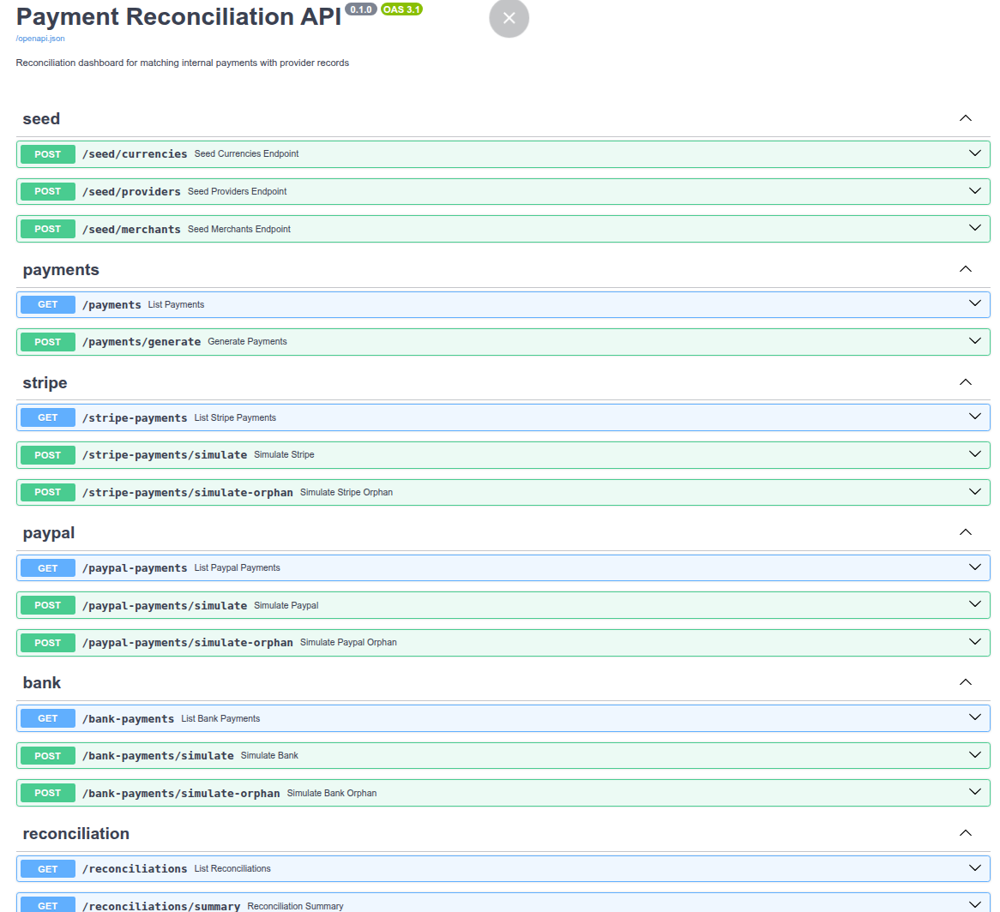

**n8n:** import the workflows (see [n8n workflows](#n8n-workflows)) and run WF1, WF2 (a few times), WF3, WF4, WF5, optionally WF7, then WF6.

</details>

---

## How matching works

For each provider record, the engine scores every unreconciled internal payment and keeps the highest-scoring candidate if its confidence is at least **65%**.

### Scoring

Amount and date are tiered: only the highest tier that applies is counted.

| Signal | Points | Counted toward the maximum when |
|--------|--------|---------------------------------|
| Amount: exact | 100 | Always |
| Amount: equals internal amount minus fee | 80 | Always |
| Amount: within 5% | 50 | Always |
| Card BIN + last 4 | 50 | Both records have card data |
| IBAN country + last 4 | 50 | Both records have IBAN data |
| Merchant VAT number | 50 | Both records have a VAT number |
| Date: same day | 30 | Always |
| Date: within 1 day | 20 | Always |
| Date: within 7 days | 10 | Always |

```
confidence = score / max_possible_score × 100
```

`max_possible_score` only includes signals that both records can provide. A PayPal wallet payment has no card or IBAN data, so its maximum is 180 (amount 100 + VAT 50 + date 30). A Stripe card payment adds card data, for a maximum of 230. Both reach 100% on a perfect match, so confidence is comparable across providers.

**Worked example.** A €50.00 PayPal payment settles the next day as €48.25 after PayPal's fee. Fee-adjusted amount (80) + VAT (50) + within 1 day (20) = 150 / 180 = **83%**. That clears the threshold, and the status is `matched_with_fee`.

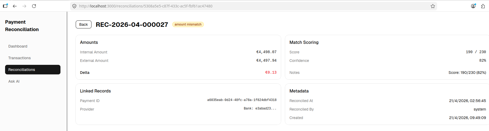
*Reconciliation detail: score, maximum score and confidence alongside the matched provider and internal records.*

### Statuses

| Status | Meaning |
|--------|---------|
| `matched` | Above threshold, exact amount |
| `matched_with_fee` | Above threshold, provider amount equals internal amount minus fee |
| `amount_mismatch` | Above threshold, but the amounts differ (within the 5% tier) |
| `missing_internal` | Provider record with no internal payment above threshold |
| `missing_external` | Internal payment with no provider record yet |
| `duplicate` | More than one internal payment above threshold |
| `disputed` | Manually flagged for review |

To reproduce the one-sided statuses: `missing_internal` comes from the `simulate-orphan` endpoints (the seed script creates 2 per provider). `missing_external` appears if you generate payments and run reconciliation without calling the `simulate` endpoints first.

---

## Dashboard

| | |
|---|---|
| 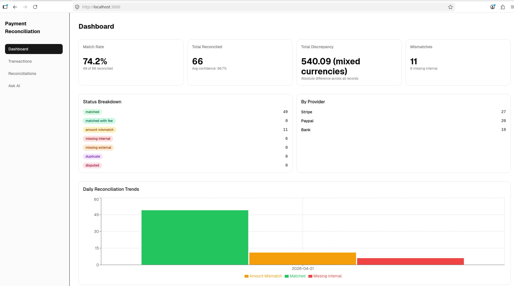 **Home:** match rate, total reconciled, status breakdown, provider distribution, daily trends | 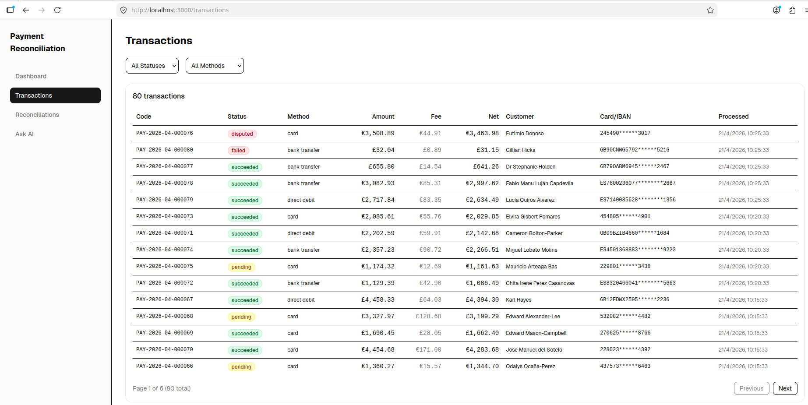 **Transactions:** internal payments filtered by status, provider and method |
| 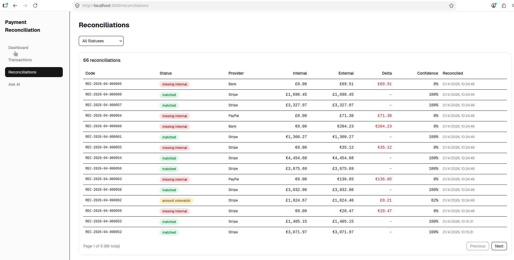 **Reconciliations:** paginated grid with status filter and confidence column | 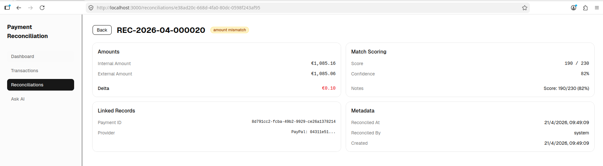 **Detail:** internal vs external record, delta and scoring breakdown |
| 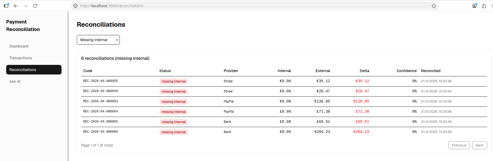 **Missing external:** internal payments with no provider record | 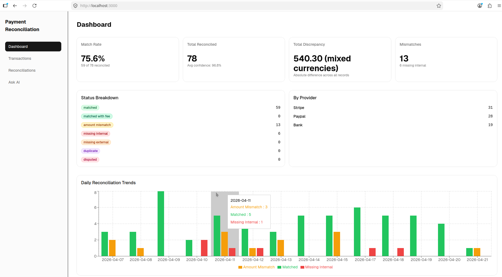 **Trends:** daily stacked bar chart, aggregated with Pandas on the API side |

---

## n8n workflows

Workflows live in `n8n/workflows/` as JSON exports.

| Workflow | Trigger | What it does |
|----------|---------|-------------|
| WF1 `seed_base_data` | Manual | Seeds currencies, providers and merchants |
| WF2 `generate_fake_payments` | Every 5 min | Generates 5 internal payments |
| WF3 `simulate_stripe` | Every 10 min | Simulates Stripe records from recent card payments |
| WF4 `simulate_paypal` | Every 30 min | Simulates PayPal records from recent card and wallet payments |
| WF5 `simulate_bank` | Every hour | Simulates bank transfer records from recent bank payments |
| WF6 `run_reconciliation` | Every 15 min | Runs the reconciliation engine |
| WF7 `simulate_orphans` | Manual | Creates 2 orphan records per provider to demonstrate `missing_internal` |

**Import:** open http://localhost:5678, create a new workflow, choose **Import from file** from the top-right menu, and select a JSON file. Publish WF2 to WF6 to activate their schedules. WF1 and WF7 stay manual. Workflows call the API at `http://host.docker.internal:8000`, so the API must be running.

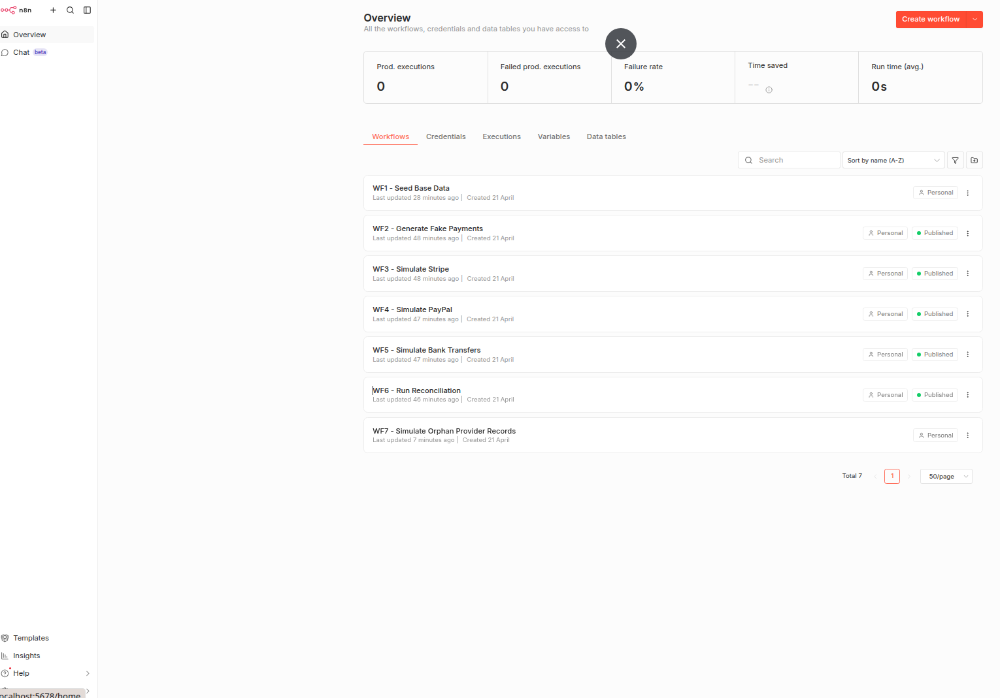

---

## Ask AI

`POST /ask` accepts a plain-text question in English or Spanish and answers from the database using a two-step LangChain chain: Claude generates SQL from the schema, the API executes it, and Claude turns the result rows into a natural language answer.

```bash
curl -X POST http://localhost:8000/ask \
  -H "Content-Type: application/json" \
  -d '{"question": "What is the match rate for this week?"}'
```

Requires `ANTHROPIC_API_KEY` in `apps/api/.env`.

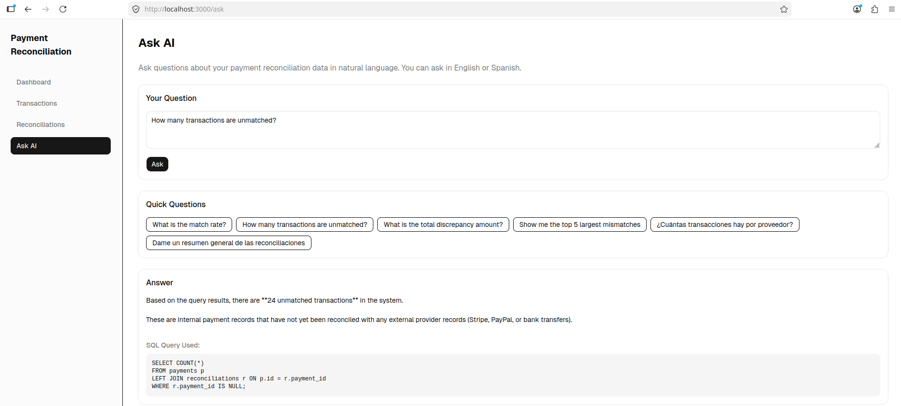

---

## API reference

Full interactive docs at http://localhost:8000/docs. `.http` files for VS Code REST Client are in `apps/api/http/`.

| Method | Path | Description |
|--------|------|-------------|
| GET | `/health` | Health check |
| POST | `/seed/currencies`, `/seed/providers`, `/seed/merchants` | Seed reference data |
| POST | `/payments/generate?count=N` | Generate internal payments (1 to 50, default 5) |
| POST | `/{stripe,paypal,bank}-payments/simulate` | Simulate provider records from recent internal payments |
| POST | `/{stripe,paypal,bank}-payments/simulate-orphan?count=N` | Create provider records with no internal payment |
| POST | `/reconciliations/run` | Run the reconciliation engine |
| GET | `/reconciliations` | List reconciliations (paginated, filter by status) |
| GET | `/reconciliations/{id}` | Reconciliation detail |
| GET | `/reconciliations/summary` | Dashboard KPIs: match rate, totals, confidence stats |
| GET | `/reconciliations/trends?days=N` | Daily trends |
| GET | `/reconciliations/missing-external` | Internal payments with no provider match |
| POST | `/ask` | Natural language query |

---

## Testing

```bash
npm run api:test    # pytest
npm run web:test    # Vitest
```

| Suite | Tests | Covers |
|-------|-------|--------|
| `tests/test_engine.py` | 21 | Amount, currency, card, IBAN, VAT and date scoring; confidence calculation |
| `tests/test_endpoints.py` | 15 | Health, list, summary and detail endpoints |
| `tests/test_service.py` | 11 | Status mapping, provider and currency lookup, reconciliation flow |
| `src/lib/format.test.ts` | 5 | Currency formatting |
| `src/lib/status-colors.test.ts` | 6 | Status badge colors |
| `src/components/layout.test.tsx` | 3 | Navigation layout |

API tests run in-process with `httpx.AsyncClient` over `ASGITransport` and override the database session with `AsyncMock`, so no database is needed. Frontend tests use Vitest with jsdom and Testing Library, wrapped in `MemoryRouter` where routing is involved.

<details>
<summary><b>All convenience scripts</b></summary>

| Command | What it does |
|---------|-------------|
| `npm run initial-seed` | Seed, generate, simulate and reconcile |
| `npm run api` / `npm run web` | Start the FastAPI or Vite dev server |
| `npm run api:test` / `npm run web:test` | Run pytest or Vitest |
| `npm run api:lint` / `npm run api:lint:fix` | Run ruff (optionally with auto-fix) |
| `npm run web:lint` | Run ESLint |
| `npm run dc:up` / `npm run dc:down` | Start or stop the stack |
| `npm run dc:ps` / `npm run dc:logs` | Show containers or follow logs |
| `npm run dc:clean` | Stop the stack and remove volumes |

</details>

---

## Project structure

```
clear-ledger/
├── apps/
│   ├── api/                      # FastAPI backend
│   │   ├── app/
│   │   │   ├── reconciliation/
│   │   │   │   ├── engine.py     # Scoring and confidence
│   │   │   │   ├── service.py    # Orchestration and persistence
│   │   │   │   └── router.py     # REST endpoints
│   │   │   ├── payment/          # Internal payments (source of truth)
│   │   │   ├── stripe/ paypal/ bank/   # Provider models and routers
│   │   │   ├── merchant/ currency/ provider/   # Reference data
│   │   │   ├── ask/              # LangChain NL query endpoint
│   │   │   ├── seed/  common/
│   │   │   ├── config.py  database.py  main.py
│   │   ├── http/                 # REST Client request files
│   │   └── tests/
│   └── web/                      # React frontend
│       └── src/ (api/, components/, lib/, pages/, types/)
├── n8n/workflows/                # Exported workflow JSON
├── scripts/initial-seed.sh
└── docker-compose.yml
```

---

## Design decisions and trade-offs

| Decision | Why | Cost |
|----------|-----|------|
| Money as integer minor units | No floating point rounding on currency | Every boundary has to convert for display |
| Scoring instead of exact key matching | Provider data rarely has a clean key back to internal records | Thresholds need tuning per business |
| Dynamic maximum score | Fair confidence across providers with different field sets | Harder to explain than a fixed scale |
| 65% threshold | Tolerates fees and settlement delay without accepting weak matches | Single global value, not per merchant |
| Greedy best match per provider record | Simple and fast | Order-dependent: an earlier record can claim an internal payment that a later record matched better. A global assignment would avoid this at higher cost |
| Separate table per provider | Clean schema and type safety for provider-specific fields | A new provider means a new table |
| n8n for provider simulation | Visual, observable stand-in for real webhooks | One more service to run |
| Pandas for trends | Concise aggregation code | Loads all rows into memory |
| Two-step LangChain chain | Reliable SQL generation, then a readable answer | Two LLM calls per question |
| Human-readable codes (`PAY-2026-03-000012`) | Easy to reference in support and logs | Per-prefix counter table serializes code generation |

---

## Known limitations and roadmap

- **VAT number identifies the merchant, not the transaction.** It narrows candidates but adds the same 50 points to every payment from that merchant, so two same-amount, same-day payments to one merchant are hard to tell apart. Next step: use VAT as a filter rather than a scored signal.
- **Summary KPIs add amounts across currencies.** Totals should be broken down per currency; a combined total would need exchange rate data.
- **NL-to-SQL hardening.** Generated SQL should run under a read-only database role with SELECT-only validation, a statement timeout and a row limit.
- **No migrations.** The schema is created with SQLAlchemy `create_all` at startup. Alembic is needed before the schema can evolve safely.
- **Pairwise scoring.** Every provider record is scored against every unreconciled internal payment. Blocking candidates by currency and date window is the first step for larger volumes.
- **Non-idempotent ingestion.** Simulated provider records are inserted on every run. Real ingestion should enforce provider transaction IDs as unique keys.
- **Polling.** Reconciliation runs every 15 minutes; it should run when a provider record arrives.
- **Synchronous LLM call in an async endpoint.** `/ask` blocks the event loop; it should use the async chain API.
- **Logging** uses `print`; structured JSON logs are next.
- **Production path:** container platform for `api` and `web`, managed PostgreSQL, a secrets manager for `DATABASE_URL` and `ANTHROPIC_API_KEY`, OpenTelemetry for metrics and tracing, CI that builds and deploys images, and `tenant_id` with row-level security for multi-tenancy.